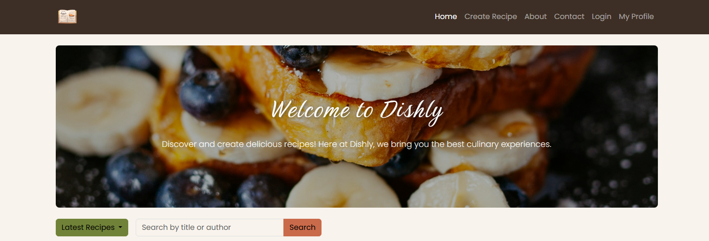

# My CSS-frameworks resit assignment

---

This assignment focuses on building a recipe app where you can read other peoples recipes,create your own recipes and checking out your profile page.

## Description

- This project showcases how my recipe page is styled using Bootstrap.

---

## Features:

- Looking up recipes
- Seeing the ingredients and instructions to make the dish
- Seeing your profile page with the recipes you have made
- Leaving a comment at the different dishes
- Creating your own recipe

---

## Licence

MIT License

---

## Contact

Lise Ervik - [LinkedIn] (https://www.linkedin.com/in/lise-ervik-9b688b237/) - [Portfolio] (https://liz-nor.github.io/Portfolio1/)

## Acknowledgement

I want to thank my teachers for support and advice
